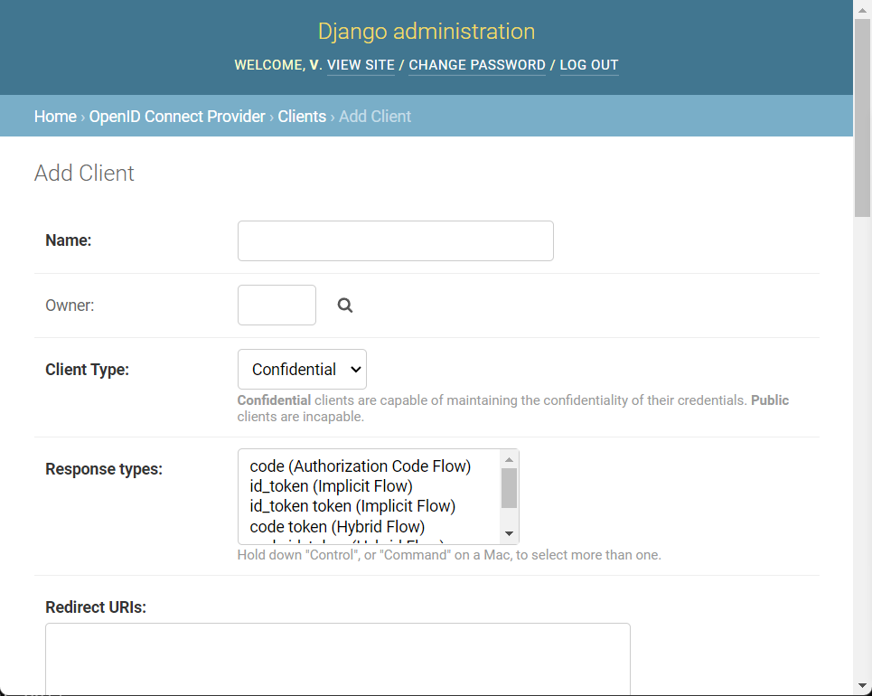
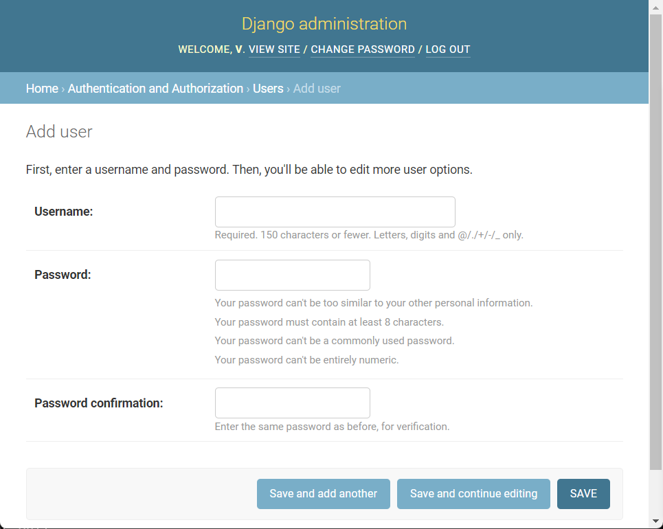

# oidc-server

A self-hosted OIDC server.

oidc-server heavily borrows from `django-oidc-provider/example`.😁

## run via docker-compose

1. start oidc server and config it.
    ```
    cd docker-demo
    # all config is in .env
    make run
    make init  # create a rsa key and a super user
    ```
1. Open `http://127.0.0.1:8888/admin/` and add client.
1. The uri for client.
    ```
    OIDC_AUTH_URI=http://localhost:8888/oauth/authorize/
    OIDC_TOKEN_URI=http://localhost:8888/oauth/token/
    OIDC_USERINFO_URI=http://localhost:8888/oauth/userinfo/
    ```
1. Open `http://127.0.0.1:8888/admin/auth/user/` to add user.

## screenshots

1. Add OIDC Client

1. Add new user

